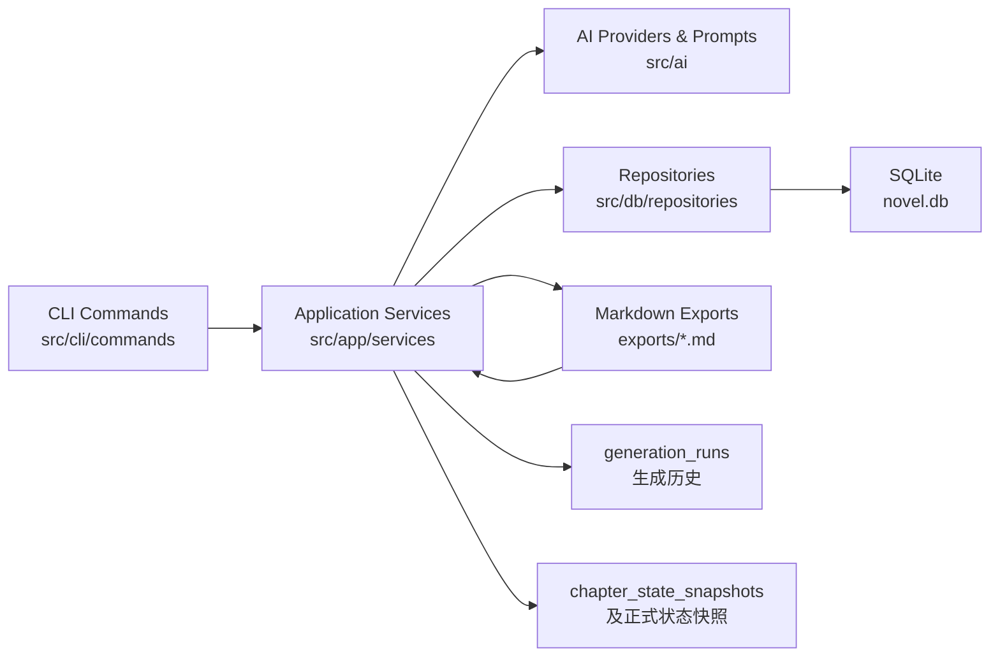
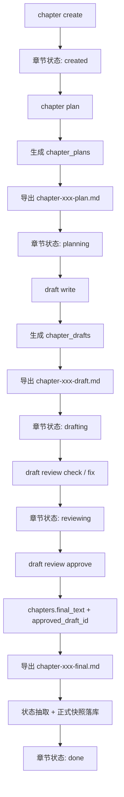
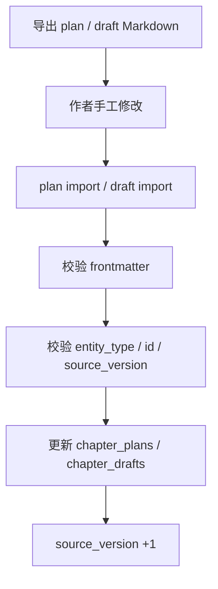
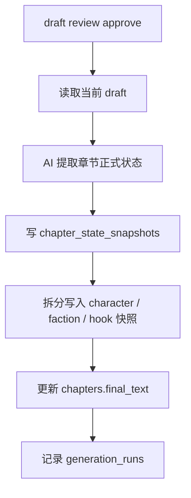

# hai-novel

一个基于 TypeScript、CLI 和 SQLite 的 AI 小说编写工具。

当前已支持：

- 项目初始化
- 总纲与分卷规划
- 人物、势力、关系、设定、钩子管理
- 物品与人物持有关系管理
- 本章 `plan` 生成
- 基于 `plan` 的 `draft` 生成
- `review check / fix / approve`
- `plan / draft / final` Markdown 导出
- `plan / draft` Markdown 手工修改后回写
- 生成历史、prompt 查看、AI 状态检查
- 生成历史导出为 Markdown / JSON

## 系统目标

这个项目的目标不是让 AI 一次性“写完整本书”，而是把小说创作拆成一条可管理、可审阅、可回写、可追踪的生产线。

- 用结构化方式管理人物、势力、关系、设定、钩子、物品和大纲
- 先写章节 `plan`，再基于 `plan` 生成 `draft`
- 允许作者直接修改导出的 Markdown，再回写数据库
- 只有 `approve` 才会把草稿转成 `final`，并写入正式状态
- 让每次 AI 生成、每次状态抽取、每次正式落库都可追溯

## 架构概览

项目采用 `CLI -> Application Service -> Repository / AI Provider -> SQLite` 的分层结构。



这套分层重点是：

- CLI 只负责参数解析、命令路由和结果展示
- Service 负责业务规则、状态推进、模块协作和事务边界
- Repository 负责表级读写，不承担复杂业务决策
- AI 层负责 prompt 构造、provider 适配和响应解析
- Markdown 导出与回写作为作者可见层，和数据库形成双向闭环

## 模块设计

### 1. CLI 层：命令入口

目录：`src/cli/commands`

职责：

- 接收命令行参数
- 转换为 Service 层输入
- 输出表格、摘要、日志和错误提示

主要命令分组：

- `project / outline / volume`：项目与大纲主链路
- `character / faction / relation / lore / item / hook`：设定与关系维护
- `chapter / plan / draft`：章节创作主链路
- `state`：状态预览、正式状态查看、补同步
- `run / prompt / ai`：生成历史、提示词调试、AI 联调诊断

### 2. 应用服务层：业务编排核心

目录：`src/app/services`

职责：

- 组合 Repository、AI Provider 和文件导出逻辑
- 处理章节状态推进
- 区分“中间态写入”和“正式状态写入”
- 统一事务一致性与错误语义

核心服务：

- `ProjectService / OutlineService / PlanService`
  - 管理项目、总纲、分卷、章节规划与规划回写
- `CharacterService / FactionService / RelationService / LoreService / ItemService / HookService`
  - 管理人物、势力、关系、设定、物品、钩子及其关联
- `ChapterService`
  - 创建章节、生成 `plan`、导出 `plan / draft / final`
- `DraftService`
  - 负责 `draft write / review / drop / import`
- `ChapterContextBuilder`
  - 聚合一章写作所需的上下文，包括人物、势力、物品、钩子和大纲链路
- `ApprovalService`
  - 在 `approve` 时统一处理草稿批准、final 同步、正式状态抽取、正式状态写入、生成记录落库
- `MarkdownSyncService`
  - 负责 Markdown frontmatter 解析、section 提取、版本校验和回写
- `StateExtractionService / StateUpdateService / StateService`
  - 负责 AI 提取正式状态、写入快照、展示正式状态和预览状态
- `RunService / PromptService / AIDoctorService`
  - 负责生成历史查看导出、prompt 预览、provider 诊断

### 3. AI 层：模型接入与提示词

目录：`src/ai`

职责：

- 定义统一 provider 接口
- 适配 `mock / openai / anthropic / custom`
- 按任务组织 prompt 模板
- 统一解析 JSON / 非 JSON 响应，输出明确错误

当前主要 AI 任务：

- `chapter-plan`：生成章节规划
- `draft-write`：基于上下文与 plan 生成草稿
- `draft-fix`：基于 review 问题修订草稿
- `state-extract`：从正式文稿中提取章节正式状态

### 4. 持久化层：SQLite 与 Repository

目录：`src/db`

职责：

- 管理 migration
- 定义 Repository 读写边界
- 把结构化数据持久化到 `novel.db`

特点：

- 全部主键采用自增数字 `id`
- Repository 尽量保持轻量，避免把复杂业务逻辑塞进 SQL
- 创作中间态和正式状态分离，方便回溯和补同步

### 5. 领域类型层：统一数据模型

目录：`src/domain/types`

职责：

- 定义 CLI、Service、Repository 共享的数据结构
- 为输入输出、数据库记录、状态快照提供统一类型约束
- 用中文注释约束字段语义，减少维护歧义

## 核心数据实体

可以把系统数据分成 4 组。

### 1. 设定层

- `projects`：小说项目
- `outlines`：总纲、分卷与大纲节点
- `characters`：人物
- `factions`：势力
- `character_relations`：人物与人物关系
- `character_faction_relations`：人物与势力关系
- `lore_entries`：世界观、职业体系、规则设定
- `items`：物品
- `character_items`：人物持有物品关系
- `story_hooks`：全局钩子
- `hook_chapter_links`：钩子在各章节中的埋设 / 推进 / 回收记录

### 2. 创作中间态

- `chapters`：章节主记录，包含章节状态、`final_text`、`approved_draft_id`
- `chapter_plans`：章节规划，可导出 Markdown，可回写
- `chapter_drafts`：章节草稿，可导出 Markdown，可回写，可 `drop`

### 3. 正式状态层

- `chapter_state_snapshots`：章节正式状态快照
- `character_state_snapshots`：人物正式状态快照
- `faction_state_snapshots`：势力正式状态快照
- `hook_state_snapshots`：钩子正式状态快照

补充说明：

- 物品正式状态当前采用轻量方案，先存放在 `chapter_state_snapshots.raw_payload`
- 这样能先满足审批后回看物品状态的需求，避免过早引入更重的独立物品状态表

### 4. 可追溯层

- `generation_runs`：记录每次生成、修订、检查、状态抽取的输入输出摘要与模板元数据

它主要用于：

- 回看某次 plan / draft / fix / state extract 是如何生成的
- 导出为 Markdown / JSON 做审阅或归档
- 在 prompt 调优时定位某次生成用了哪一版模板

## 核心数据流转

### 1. 章节创作主链路



### 2. Markdown 回写链路



设计原则：

- Markdown 是作者可直接编辑的工作界面
- 数据库是系统的结构化事实来源
- 通过 `source_version` 检测版本冲突，避免旧文件覆盖新内容
- `--force` 只在作者明确知道风险时使用

### 3. 正式状态同步链路



这里最重要的约束是：

- `plan` 完成后不会更新世界正式状态
- `draft` 生成后不会更新世界正式状态
- `check / fix` 不会更新世界正式状态
- 只有 `approve` 才会更新正式状态快照
- `state chapter-preview` 只做预览，不会落正式库

## 数据状态与写入原则

### 1. 章节状态

章节会在主流程里自动推进：

- `created`：章节刚创建
- `planning`：章节规划已生成并导出
- `drafting`：草稿已生成
- `reviewing`：已经执行过 `check` 或 `fix`
- `done`：草稿已批准，正式文稿与正式状态都已落库

### 2. Plan 状态

`chapter_plans.status` 当前采用轻量策略：

- `active`：当前有效规划
- 旧规划在新规划生成后会归档，不再作为默认写稿输入

### 3. Draft 状态

`chapter_drafts.status` 体现的是稿件生命周期：

- `generated`：AI 生成或修订后的当前稿件
- `checked`：执行过 `check`，记录了 review 报告
- `approved`：已转正为正式文稿
- `dropped`：作者明确丢弃，不再参与默认导出和默认状态预览

### 4. Hook 状态与章节内推进状态

系统里和钩子相关的状态分成两层：

- `story_hooks.status`
  - 表示钩子全局层面的生命周期，例如 `pending / active / resolved / closed`
- `hook_chapter_links.status`
  - 表示钩子在某一章里的执行状态，例如 `planned / done / skipped`

这也是为什么项目里仍然保留 hook 语义的 `planned`，但章节状态已经改成 `created`。

### 5. 正式状态快照

正式状态快照是“按章节批准结果沉淀”的，不是实时覆盖式状态表。

优点：

- 可以回看某章批准后，人物 / 势力 / 钩子 / 物品在当时被认定成什么状态
- 后续需要补同步时，可以按章节重建，而不是直接覆盖全局现状
- 便于做“截至第 N 章”的项目状态查看

## 命令与状态变化对照

下面这张表用于说明“执行某个命令后，数据库里哪些状态会变化，哪些不会变化”。

| 命令 | 会变化的状态 / 字段 | 不会变化的内容 |
| --- | --- | --- |
| `chapter create` | `chapters.status -> created` | 不会生成 plan、draft、final，也不会写正式状态 |
| `chapter plan` | 生成新的 `chapter_plans(active)`；旧 active plan 归档为 `archived`；`chapters.status -> planning`；写入 `generation_runs(chapter_plan)`；导出 plan Markdown | 不会更新人物、势力、钩子、物品等正式状态 |
| `plan import` | 更新 `chapter_plans.plan_text / author_intent / source_version / last_imported_at / updated_from=manual_import` | 不会改变章节状态，不会写正式状态 |
| `chapter export --source plan` | 更新 `chapter_plans.last_export_path / last_exported_at` | 不会改变章节状态，不会改动 plan 正文 |
| `draft write` | 生成新的 `chapter_drafts(status=generated)`；`chapters.status -> drafting`；写入 `generation_runs(draft_write)`；导出 draft Markdown | 不会更新正式状态，不会写 `chapters.final_text` |
| `draft review --action check` | `chapter_drafts.status -> checked`；更新 `review_report / review_notes`；`chapters.status -> reviewing`；写入 `generation_runs(draft_review_check)` | 不会更新 `final_text`，不会写正式状态快照 |
| `draft review --action fix` | 当前 draft 会被修订并回写；`draft_text` 更新；`source_version +1`；`updated_from=ai_fix`；`status -> generated`；`chapters.status -> reviewing`；写入 `generation_runs(draft_review_fix)`；重新导出 draft Markdown | 不会更新正式状态，不会写 `chapters.final_text` |
| `draft import` | 更新 `chapter_drafts.draft_text / source_version / last_imported_at / updated_from=manual_import` | 不会直接改变章节状态，不会写正式状态；已 `approved` 或 `dropped` 的草稿禁止导入 |
| `chapter export --source draft` | 更新 `chapter_drafts.last_export_path / last_exported_at` | 不会改变章节状态，不会改动 draft 正文 |
| `draft drop` | `chapter_drafts.status -> dropped`；章节状态会按剩余数据重新推导：优先 `done`，否则 `reviewing / drafting / planning / created` | 不会写正式状态快照；已 `approved` 的草稿禁止 drop |
| `draft review --action approve` | `chapter_drafts.status -> approved`；`chapters.final_text / approved_draft_id / status=done` 更新；写入 `chapter_state_snapshots` 和人物 / 势力 / 钩子正式快照；写入 `generation_runs(state_extract / draft_review_approve)`；导出 final Markdown | 不会保留“未正式生效”的状态，approve 就是正式落库点 |
| `chapter export --source final` | 导出 final Markdown | 不会改变章节状态，也不会重建正式状态 |
| `state chapter-preview` | 无数据库状态变化，只返回“如果现在抽取状态会得到什么”的预览结果 | 不会写快照，不会改章节状态 |
| `state approve-sync` | 删除并重建当前章节已有的正式状态快照 | 不会改变 `chapters.status`，不会改 draft 状态 |
| `hook bind` | 新增 `hook_chapter_links`；根据 `link_type` 可能自动更新 `story_hooks.status / start_chapter_id / end_chapter_id` | 不会改变章节创作状态 |
| `hook update` | 更新 `story_hooks.status / start_chapter_id / target_chapter_id / end_chapter_id` | 不会改变章节创作状态 |

补充约束：

- `approved` draft 现在是冻结状态，不能再执行 `review / import / drop`
- `dropped` draft 不再参与默认 `chapter export --source draft` 和 `state chapter-preview`
- `plan / draft / check / fix` 都只影响创作中间态，不会更新正式世界状态
- 只有 `approve` 才会把正文、正式状态快照和生成历史一起推进到“正式生效”

## 模块协作关系

如果把一次完整创作看成协作链路，大致是：

1. 设定模块先沉淀世界基础事实：人物、势力、关系、设定、物品、钩子。
2. 大纲模块决定全书、分卷、章节的结构目标。
3. `ChapterContextBuilder` 把设定层和大纲层聚合成“本章写作上下文”。
4. `ChapterService` 和 `DraftService` 调用 AI 生成 `plan / draft / fix`。
5. `MarkdownSyncService` 让作者可以脱离 CLI，直接在 Markdown 中编辑。
6. `ApprovalService` 在最后一跳把 draft 转成 final，并驱动正式状态同步。
7. `RunService` 和 `StateService` 提供可追溯与可观测能力。

## 环境要求

- Node.js `>= 20`
- npm

## 安装依赖

```bash
npm install
```

## 常用脚本

```bash
npm run dev -- --help
npm run build
npm run typecheck
npm run test
```

## 快速开始

### 1. 初始化工作区

```bash
npm run dev -- init
```

初始化后会生成：

- `novel.config.json`
- `data/novel.db`
- `exports/`

### 2. 创建项目

```bash
npm run dev -- project create \
  --name "测试小说" \
  --genre "仙侠" \
  --premise "少年卷入宗门纷争" \
  --style "热血克制"
```

### 3. 设定总纲与分卷

```bash
npm run dev -- outline set \
  --project 1 \
  --title "测试小说总纲" \
  --summary "主角卷入宗门暗战，并逐步揭开黑玉佩秘密。" \
  --goal "完成主线开篇铺陈"

npm run dev -- volume plan \
  --project 1 \
  --from-outline \
  --instruction "第一卷重点写主角入宗与立足"
```

查看：

```bash
npm run dev -- outline show --project 1
npm run dev -- volume list --project 1
```

### 4. 录入人物、势力与设定

```bash
npm run dev -- faction add --project 1 --name "青岚宗" --type "宗门"
npm run dev -- character add --project 1 --name "林渡" --role "protagonist" --profession "外门弟子"
npm run dev -- lore add --project 1 --type "profession_system" --title "外门晋升规则"
npm run dev -- item add --project 1 --name "黑玉佩" --category "artifact" --rarity "rare"
npm run dev -- character item:add --project 1 --character 1 --item 1 --type carry --start-chapter 1
```

### 5. 建章节并生成 plan / draft

```bash
npm run dev -- chapter create \
  --project 1 \
  --title "第001章 雨夜入宗" \
  --summary "主角带着异物进入宗门"

npm run dev -- chapter plan \
  --project 1 \
  --chapter 1 \
  --intent "突出悬念感"

npm run dev -- plan show --chapter 1

npm run dev -- draft write \
  --project 1 \
  --chapter 1
```

### 6. 评审草稿并导出正式文稿

```bash
npm run dev -- draft review --draft 1 --action check
npm run dev -- draft review --draft 1 --action fix
npm run dev -- draft review --draft 1 --action approve
```

说明：

- `check` 只汇报问题，不改写正文
- `fix` 会生成新的修订 draft，但不会更新正式状态
- 只有 `approve` 才会把 draft 变成 final，并写入正式状态快照
- 若 `approve` 后 final Markdown 导出失败，系统会明确提示“审批已成功，仅导出失败”；这时可单独重跑 `chapter export --source final`

### 7. 导出后手工修改并回写

```bash
npm run dev -- chapter export --chapter 1 --source plan
npm run dev -- plan import --chapter 1 --input exports/chapter-001-plan.md

npm run dev -- chapter export --chapter 1 --source draft
npm run dev -- draft import --draft 1 --input exports/chapter-001-draft.md
```

如果数据库中的源版本已经变化，可显式覆盖：

```bash
npm run dev -- plan import --chapter 1 --input exports/chapter-001-plan.md --force
npm run dev -- draft import --draft 1 --input exports/chapter-001-draft.md --force
```

导出文件默认在 `exports/`：

- `exports/chapter-001-plan.md`
- `exports/chapter-001-draft.md`
- `exports/chapter-001-final.md`

### 8. 章节状态流转

章节会在主流程里自动推进状态：

- `created`：刚创建章节
- `planning`：已生成章节 plan
- `drafting`：已生成 draft
- `reviewing`：已执行 `check` 或 `fix`
- `done`：已 `approve` 并写入正式文稿

可通过以下命令查看：

```bash
npm run dev -- chapter show --id 1
```

### 9. dropped 草稿的默认行为

- `draft drop` 后，该草稿不会再被默认的 `chapter export --source draft` 选中
- `state chapter-preview` 默认也不会再使用被 dropped 的草稿
- 如果某章最新草稿已经被 dropped，CLI 会明确提示，而不是继续拿这份稿件参与后续流程

## 常用命令

```bash
novel init
novel project create
novel project list
novel outline set
novel outline show
novel outline add
novel outline list
novel volume plan
novel volume list
novel faction add
novel faction list
novel character add
novel character list
novel relation character:add
novel relation character:list
novel relation faction:add
novel relation faction:list
novel lore add
novel lore list
novel item add
novel item list
novel item show
novel character item:add
novel character item:list
novel character item:remove
novel hook add
novel hook list
novel hook show
novel hook bind
novel hook update
novel chapter create
novel chapter show
novel chapter plan
novel chapter export
novel plan show
novel plan import
novel draft write
novel draft review
novel draft drop
novel draft import
novel state show
novel state chapter-preview
novel state approve-sync
novel run history
novel run show
novel run export
novel prompt chapter-plan
novel prompt draft-write
novel prompt draft-fix
novel ai status
novel ai test
novel ai doctor
```

## AI Provider

默认使用 `mock` provider，适合本地开发和流程验证。

项目现在支持从项目根目录的 `.env` 自动加载环境变量，推荐先复制一份：

```bash
cp .env.example .env
```

然后手动指定当前使用的 provider：

```bash
# 可选：mock | openai | anthropic | custom
NOVEL_AI_PROVIDER=openai
NOVEL_AI_MODEL=gpt-4.1-mini
```

如需使用 OpenAI，需要在 `.env` 或运行环境里配置：

```bash
export OPENAI_API_KEY="your_key"
```

如需使用 Anthropic，需要配置：

```bash
export ANTHROPIC_API_KEY="your_key"
```

如需接入自定义模型网关，当前默认按“OpenAI Chat Completions 兼容协议”接入，至少配置：

```bash
export CUSTOM_AI_BASE_URL="https://your-custom-ai.example.com"
```

如果你的网关需要鉴权，再额外配置：

```bash
export CUSTOM_AI_API_KEY="your_key"
```

常见切换方式示例：

```bash
# OpenAI
NOVEL_AI_PROVIDER=openai
NOVEL_AI_MODEL=gpt-4.1-mini

# Anthropic
NOVEL_AI_PROVIDER=anthropic
NOVEL_AI_MODEL=claude-sonnet-4-20250514

# Custom
NOVEL_AI_PROVIDER=custom
NOVEL_AI_MODEL=your-model-name
CUSTOM_AI_BASE_URL=https://your-custom-ai.example.com
```

自定义 provider 还支持这些可选参数：

- `CUSTOM_AI_CHAT_PATH`：生成请求路径，默认 `/v1/chat/completions`
- `CUSTOM_AI_MODELS_PATH`：`ai doctor` 网络探测路径，默认 `/v1/models`
- `CUSTOM_AI_AUTH_HEADER`：认证头名称，默认 `Authorization`
- `CUSTOM_AI_AUTH_PREFIX`：认证头前缀，默认 `Bearer`
- `CUSTOM_AI_REQUIRE_API_KEY`：是否强制要求 `CUSTOM_AI_API_KEY`，默认 `false`

除了 Provider 相关配置外，下面这些参数也可以放进 `.env` 调优：

- 显示与日志截断长度：`NOVEL_DISPLAY_*`
- 上下文控长阈值：`NOVEL_CONTEXT_MAX_*`
- 相关性打分权重：`NOVEL_RELEVANCE_*`
- AI 温度与输出预算：`NOVEL_AI_*`
- `ai doctor` 联调输出上限：`NOVEL_AI_DOCTOR_*`

随后可用以下命令检查状态：

```bash
npm run dev -- ai status
npm run dev -- ai doctor
npm run dev -- ai doctor --section config
npm run dev -- ai doctor --section network
npm run dev -- ai doctor --section all --test-generate
npm run dev -- ai doctor --section all --test-generate --test-prompt "请只回复：联调通过"
npm run dev -- ai doctor --section all --test-generate --test-task chapter-plan --project 1 --chapter 1
npm run dev -- ai doctor --section all --test-generate --test-task draft-write --project 1 --chapter 1
npm run dev -- ai doctor --section all --test-generate --test-task draft-fix --draft 1 --notes "重点收紧节奏"
```

## 状态预览与补同步

```bash
npm run dev -- state chapter-preview --chapter 1
npm run dev -- state approve-sync --chapter 1
npm run dev -- state show --project 1 --chapter 1
```

说明：

- `state chapter-preview` 会基于最新 draft 或 final 预览“如果现在提取状态，会得到什么”
- 若默认最新草稿已经被 `drop`，命令会提示你先重新生成草稿，或显式传 `--draft <id>`
- `state approve-sync` 会对已有正式章节重建状态快照
- `state show` 会展示正式快照；其中物品状态当前来自 `chapter_state_snapshots.raw_payload`

## 生成历史导出

查看历史：

```bash
npm run dev -- run history --project 1 --limit 10
npm run dev -- run show --id 3 --section all
```

导出历史：

```bash
npm run dev -- run export --id 3 --section all --format md
npm run dev -- run export --id 3 --section meta --format json --output exports/run-meta.json
```

默认导出目录：

- `exports/runs/run-003-all.md`
- `exports/runs/run-003-meta.json`

## 项目结构

```text
src/
  ai/                  # provider 适配、prompt 模板、响应解析
  app/services/        # 业务编排、状态推进、审批与回写
  cli/commands/        # CLI 命令入口
  config/              # dotenv 与运行期环境变量解析
  db/migrations/       # SQLite schema 迁移
  db/repositories/     # 数据读写封装
  domain/types/        # 统一领域类型与中文注释
  utils/               # 日志、路径、错误展示等通用能力
docs/
  v1-plan.md
  v1-task-list.md
  v2-task-list.md
test/
  *.test.mjs           # CLI、服务、迁移、错误语义等测试
```

## 当前状态

当前已经可以跑通从项目创建、世界设定录入、章节 `plan / draft` 生成、Markdown 回写，到 `approve` 后正式状态落库与 `final` 导出的主流程。

仍在继续完善的方向：

- 更强的 review 语义检查
- 更完整的自动化测试
- 更多导出格式与历史回放能力
