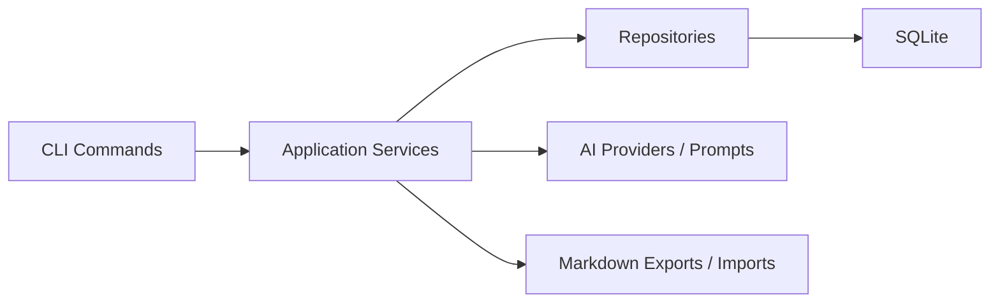
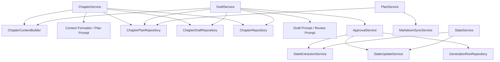
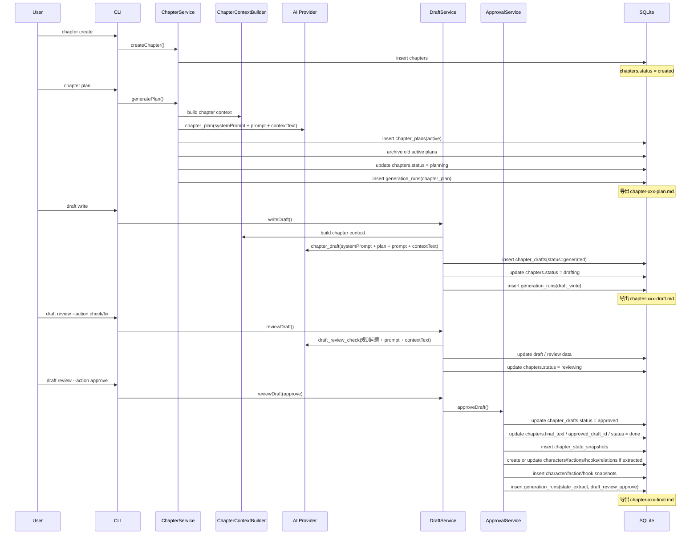
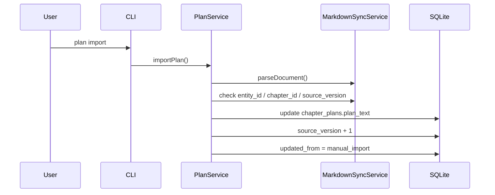
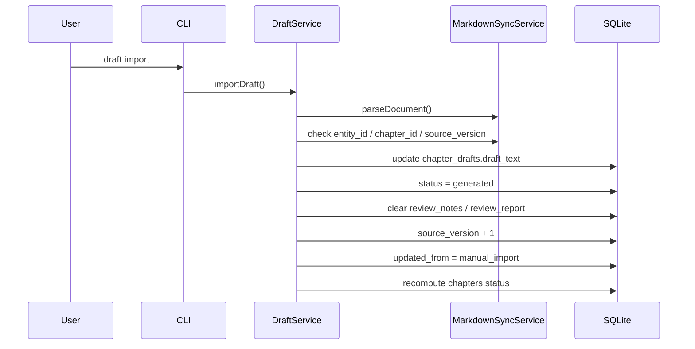
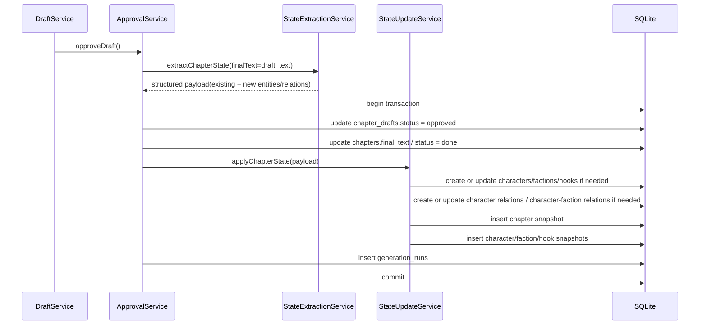
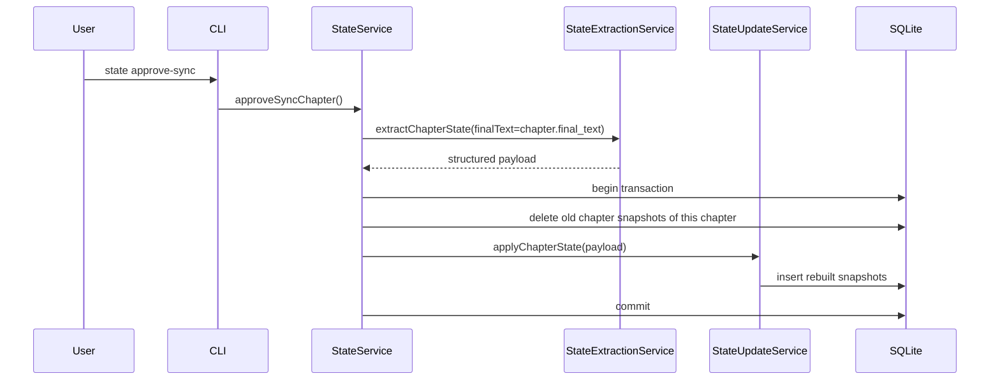

# hai-novel 模块责任与状态时序图

这份文档从工程实现角度解释两件事：

1. 各模块分别负责什么，不该负责什么
2. 一条章节创作链路里，状态是按什么顺序变化的

如果你在做下列事情，这份文档会更有用：

- 扩命令
- 改状态机
- 调整 `approve` 逻辑
- 排查“为什么这个命令没改状态”或“为什么它不该改状态”

相关文档：

- 用法说明见 [command-guide.md](command-guide.md)
- 命令状态矩阵见 [command-state-matrix.md](command-state-matrix.md)
- AI 输入清单见 [ai-input-readable-checklist.md](ai-input-readable-checklist.md)

## 1. 系统分层与责任边界

### CLI 层

负责：

- 参数解析
- 选项校验
- 调用 service
- 打印表格、日志、错误

不负责：

- 业务状态推进
- 事务控制
- 跨表一致性判断
- AI prompt 组织

### Service 层

负责：

- 业务规则
- 状态推进
- Repository 编排
- 导入导出流程
- AI 调用与结果落库
- 事务边界

不负责：

- 复杂 SQL 查询优化
- 终端展示细节

### Repository 层

负责：

- 单表或轻量关联的读写
- 基本记录创建、更新、查询

不负责：

- 章节状态机
- 跨项目归属判断
- “哪个命令应该触发什么状态”

### AI 层

负责：

- prompt 模板
- provider 适配
- 输出解析

不负责：

- 业务主状态推进
- 直接写数据库

### Markdown 层

负责：

- 给作者可直接编辑的 plan / draft / final 文件
- 提供回写入口

不负责：

- 直接定义数据库主状态

## 2. 核心服务职责图

### `ChapterService`

负责：

- `chapter create`
- `chapter plan`
- `chapter export`
- 组织 `chapter plan` 的 AI 输入

关键边界：

- 只负责章节创建、规划生成和导出
- 不负责 review 语义
- 不负责正式状态快照写入
- `plan` 的 AI 输入由 `prompt + contextText` 组成，其中 `contextText` 由 `ChapterContextBuilder` 和上下文格式化层统一生成

### `DraftService`

负责：

- `draft write`
- `draft review`
- `draft drop`
- `draft import`
- 组织 `draft write` 与 `draft review` 的 AI 输入

关键边界：

- 负责草稿工作流
- 负责章节状态从 `drafting/reviewing` 之间推进
- 只有在 `approve` 时转交 `ApprovalService`
- `review check` 现在默认是“规则检查 + AI 审查合并”，而不是纯本地规则

### `ApprovalService`

负责：

- 批准草稿
- 写 `chapters.final_text`
- 写正式状态快照
- 写审批相关生成记录

关键边界：

- 这是默认正式生效的唯一入口
- 这里必须保证事务一致性
- 在事务内统一完成：批准草稿、同步 final、状态提取结果落库、生成记录落库

### `StateExtractionService`

负责：

- 基于 final 或预览文本提取结构化状态
- 允许提取已有对象的状态，也允许提取本章明确落地的新人物 / 新势力 / 新钩子 / 新关系

关键边界：

- 只产出结构化结果
- 不直接写正式状态表

### `StateUpdateService`

负责：

- 把已抽取好的正式状态写成快照
- 在写快照前，自动补齐或更新主档案中的人物、势力、钩子、人物关系、人物-势力关系

关键边界：

- 允许在正式落库阶段补建主档案与关系
- 不做命令级状态机判断

### `PlanService`

负责：

- `plan show`
- `plan import`

关键边界：

- 只管理章节规划正文本身
- 不推进章节主状态

## 3. 章节主链路时序图

主链路不变量：

- `chapter create` 之后才能进入 `chapter plan`
- `chapter plan` 之后才能稳定进入 `draft write`
- `approve` 之前不能写正式状态快照
- `approve` 之后该 draft 必须冻结

## 4. Markdown 回写时序图

### plan 回写

结论：

- `plan import` 只更新规划正文
- 不推进 `chapters.status`
- 不写正式状态

### draft 回写

结论：

- 手工回写 draft 之后，旧 review 结论失效
- 系统会把它当作“新版本待审稿”
- 因此章节通常从 `reviewing` 回到 `drafting`

## 5. 正式状态同步时序图

### approve 默认同步

### approve-sync 补同步

结论：

- `approve-sync` 是重建正式状态，不是创作状态推进
- 它不能替代 `approve`
- 它也不应该改 `chapters.status`
- 但它会复用同一套状态抽取与正式落库逻辑，因此同样可能补齐新对象和关系

## 6. AI 输入在主链路中的位置

### `chapter plan`

当前输入结构是：

- `systemPrompt`：规划助手角色与输出约束
- `prompt`：章节标题、章节摘要、作者意图、规划要求
- `contextText`：项目、章节、大纲、人物、势力、设定、关系、物品、钩子、最近正式状态

实现位置：

- `src/app/services/chapter-service.ts`
- `src/ai/prompts/chapter-plan-prompt.ts`
- `src/ai/context-format.ts`

### `draft write`

当前输入结构是：

- `systemPrompt`：写作助手角色与输出约束
- `prompt`：章节标题、章节摘要、作者意图、额外指令、当前 plan 全文、本章钩子、关键物品
- `contextText`：与 `plan` 共用的统一章节上下文

实现位置：

- `src/app/services/draft-service.ts`
- `src/ai/prompts/draft-write-prompt.ts`
- `src/ai/context-format.ts`

### `draft review --action check`

当前不是纯规则检查，而是：

- 先做本地规则检查
- 再把规则问题、草稿正文与统一上下文一起交给 AI 审查
- 最后合并去重后落库到 `review_report`

实现位置：

- `src/app/services/draft-service.ts`
- `src/ai/prompts/draft-review-prompt.ts`

完整可读版见 [ai-input-readable-checklist.md](ai-input-readable-checklist.md)
## 7. 命令扩展时的判断清单

新增命令前，建议先问 6 个问题：

1. 这条命令是在改设定、改中间态，还是改正式状态？
2. 它是否应该推进 `chapters.status`？
3. 它是否应该写 `generation_runs`？
4. 它是否应该导出 Markdown？
5. 它是否会让旧 review 结果失效？
6. 它是否必须放进事务里？

### 什么时候应该改 `chapters.status`

可以改：

- 章节主链路命令
- 会明确改变当前章节创作阶段的命令

通常不该改：

- 设定命令
- 查询命令
- 只导出文件的命令
- 正式状态补同步命令

### 什么时候应该写正式状态快照

可以写：

- `approve`
- 明确的“重建正式状态”命令

通常不该写：

- `chapter plan`
- `draft write`
- `draft review check`
- `draft review fix`
- `plan import`
- `draft import`

## 8. 当前最重要的不变量

### 不变量 1：正式状态只能来源于已批准内容

正式状态快照要么来自：

- `draft review --action approve`
- `state approve-sync` 基于已有 `final_text` 的重建

不能来自：

- plan
- 未批准 draft
- 预览结果

补充：

- 即使 `StateUpdateService` 会补建新人物、势力、钩子和关系，这些补建动作也只能发生在正式状态链路里
- 不能在 `draft write`、`review check`、`review fix` 阶段把 AI 推测写回主档案

### 不变量 2：Repository 不应该偷偷推进章节状态

原因：

- 章节状态推进属于业务规则
- 必须由 service 在完整上下文下决定

### 不变量 3：作者手工修改 draft 之后，旧 review 结论必须失效

原因：

- 文本版本已经变了
- 旧问题报告不再可信

补充：

- 当前 `review check` 已经引入 AI 审查，因此“失效”不仅包括旧规则结论，也包括旧 AI 审查结果

### 不变量 4：跨项目引用必须在 service 层拦住

原因：

- Repository 很难知道命令语义
- service 最清楚当前命令的 project / chapter 上下文

## 9. 后续扩展建议

如果后面要做 v3，建议继续沿用现在的切分方式：

- 新的结构化设定先进入设定层
- 新的创作动作先判断它属于 `plan / draft / review` 哪一层
- 新的正式世界状态必须挂到 `approve` 或“正式重建”链路

这样可以持续保证：

- 创作中间态和正式状态不混
- Markdown 回写有边界
- 命令扩展后仍然容易 review 和回归测试
- AI 输入增强可以在 `context-format.ts` 和专用 prompt 中演进，而不用把主业务流打散
